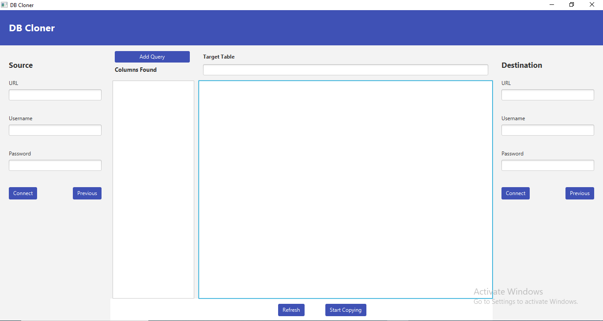
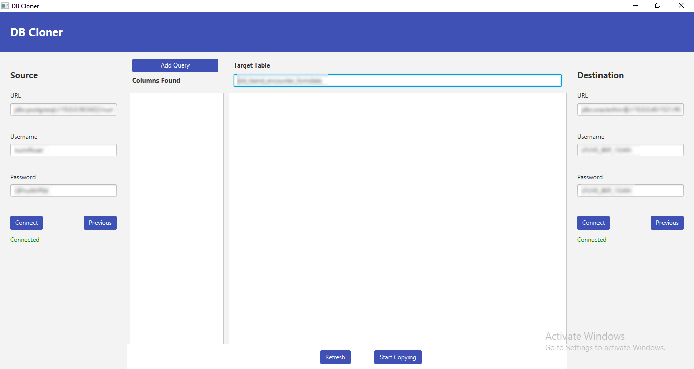
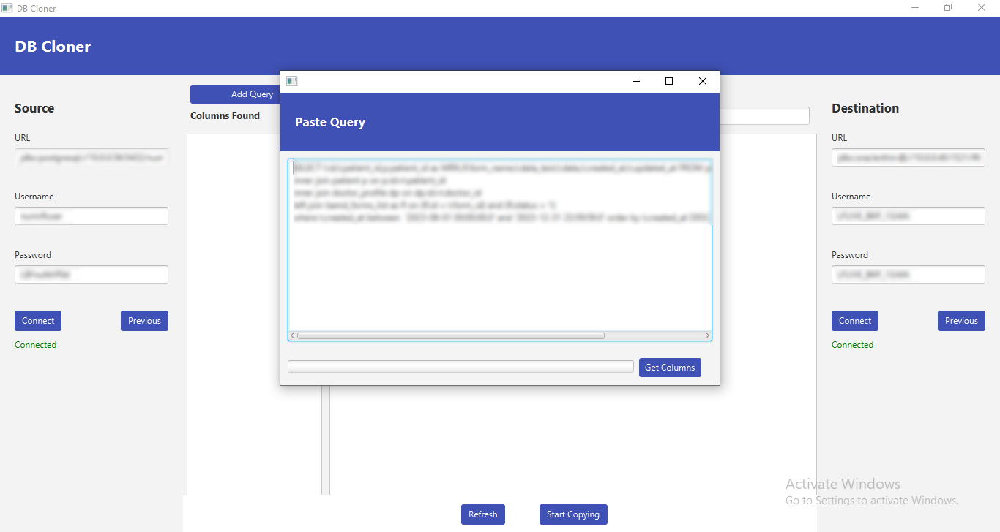
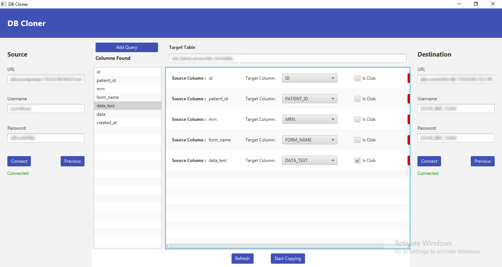

# DB-Cloner - Database Copy Utility

## Overview

The Database Copy Utility is a Java application designed to efficiently copy a large amount of data across SQL databases, supporting various database types such as MySQL, Oracle SQL, and PostgreSQL. The utility allows users to connect source and destination databases, select target tables, define custom queries, and copy data seamlessly.

## Features

- Cross-database data copying: Copy data between SQL databases of different types (MySQL, Oracle SQL, PostgreSQL, etc.).
- Dynamic query execution: Enter custom queries to fetch data from the source database based on your specific requirements.
- Column mapping: Map source columns to target columns, providing flexibility in copying only the necessary data.
- CLOB support: Handle CLOB (Character Large Object) data types during the copying process.
- User-friendly interface: Intuitive GUI for easy configuration and execution of data copy operations.

## Requirements

- Java 1.8 or higher (Ensure JavaFX runtime is added to the environment for versions higher than 8).
- Dependencies:
  - Add the corresponding database driver dependencies to the `pom.xml` file based on the target databases (MySQL, Oracle, PostgreSQL, etc.).

## How to Use

1. **Connect Databases:**
   - Enter the required parameters to connect to the source and destination databases.

2. **Select Destination Table:**
   - Choose the destination table in the destination database where you want to insert the data.

3. **Add Query:**
   - Click the "Add Query" button and paste the custom query that retrieves the necessary data from the source database.

4. **Get Columns:**
   - Click the "Get Columns" button to list the columns of the result set from your query.

5. **Column Mapping:**
   - Select the source columns to be copied and map them to target columns in the destination table.
   - Check the "is CLOB" checkbox if a column is of type CLOB.

6. **Start Copying:**
   - Click the "Start Copying" button to initiate the data copy process.

## Screenshots

*Landing Page*

*Connections*

*Add Query*

*Column Mapping*

## Note

Currently configure to work with Oracle Database as destination database.
But you can easily change a few lines here and there to make it work with any database that provides a JDBC driver.

## Contributing

If you would like to contribute to the project, please follow the guidelines outlined in the [CONTRIBUTING.md](CONTRIBUTING.md).

## License

This project is licensed under the MIT License - see the [LICENSE.md](LICENSE.md) file for details.
